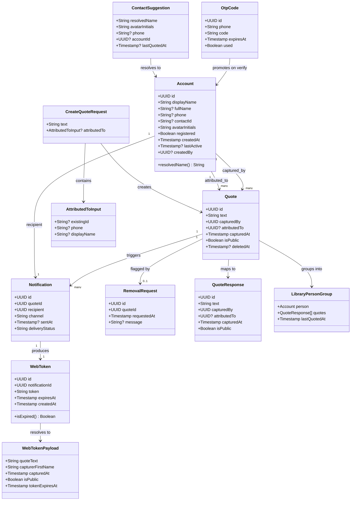

# Questadi v1.0 — Full Product Implementation

## Requirements

Implement a full-stack quote capture system that enables a registered Capturer to save attributed or unattributed quotes in under 10 seconds via a lock screen widget (iOS WidgetKit), notify the quoted person by SMS (Twilio) with a tokenized 30-day web link for viewing and consent management, and browse a private cloud-synced library of all captured quotes — with all privacy, deduplication, rate-limiting, and account lifecycle rules enforced server-side.

**Stack decision (resolved from analysis)**: Node.js 20 + TypeScript + Express + PostgreSQL (backend); SwiftUI + WidgetKit iOS 16+ (app); static CDN page (web view). Token semantics: expiry-only, no burn-on-read. SMS rate limit: rolling 24-hour window. Display name: `full_name ?? display_name`. Account identity: phone-based upsert on attribution.

---

## Entities



---

## Approach

1. **Backend Architecture — Node.js + Express + PostgreSQL**:
   - Three-tier REST API: auth routes (`/auth`), quote routes (`/quotes`), account routes (`/accounts`), public web-token routes (`/web`)
   - PostgreSQL with `pg` driver — all queries are explicit parameterized SQL, no ORM
   - JWT (HS256, 7-day expiry) issued on OTP verify, stored in iOS Keychain, sent as `Authorization: Bearer`
   - SMS dispatch is fire-and-forget after quote save: response returns immediately, Twilio call happens async with full Notification record lifecycle tracking
   - All business rules are server-enforced: registration gate, dedup (60s), rate limit (3/24h rolling), token expiry, phone upsert atomicity

2. **Account Identity — Phone-based Upsert from Day One**:
   - When a Capturer attributes a quote to a phone number, the backend executes `INSERT INTO accounts ... ON CONFLICT (phone) DO UPDATE SET display_name = EXCLUDED.display_name WHERE NOT registered RETURNING *` — one Account per phone, always
   - Unknown contacts (no phone) always create new isolated rows
   - Account promotion (unregistered → registered) is wrapped in a transaction with `SELECT ... FOR UPDATE` on the phone row to prevent race conditions

3. **WebToken Design — Expiry-only (30 days, no burn-on-read)**:
   - Quoted person can reopen the link on any device within 30 days — burn-on-read is intentionally rejected
   - Token: `crypto.randomBytes(32).toString('hex')` (256-bit entropy, 64-char hex)
   - Every token resolution checks: exists, `expires_at > now()`, and `quote.deleted_at IS NULL`
   - Token is bound to a Notification record (one SMS delivery), not to all quotes for a person

4. **iOS Architecture — SwiftUI + Async/Await**:
   - Lock screen widget is a separate WidgetKit target with a `Link` to `questadi://capture` deep link — no data in the widget, no network calls
   - `CaptureView` driven by `CaptureViewModel` (ObservableObject) — all capture state lives in one place
   - Optimistic delete on iOS: quote removed from local state immediately, DELETE call fires, `Task` is cancelled if undo tapped within 5 seconds
   - No local persistence queue in v1 — network required at save time; on failure, `CaptureView` retains state with inline error + retry button
   - Session expiry during capture: 401 from save API → retain `CaptureView` state, redirect to auth, resume save after re-auth

5. **Error Handling**:
   - Backend: all service errors are typed `AppError` subclasses carrying `code`, `httpStatus`, `message`; a single Express error middleware maps them to `{ error, code }` JSON — stack traces never exposed
   - iOS: `async throws` everywhere; `APIError` Swift enum cases drive UI state transitions (never crash on network errors)

---

## Structure

### Inheritance Relationships
1. `AppError` extends `Error` — carries `code: string`, `httpStatus: number`, `message: string`
2. `NotFoundError` extends `AppError` — httpStatus 404, code `NOT_FOUND`
3. `UnauthorizedError` extends `AppError` — httpStatus 401, code `UNAUTHORIZED`
4. `ConflictError` extends `AppError` — httpStatus 409, code `CONFLICT`
5. `RateLimitError` extends `AppError` — httpStatus 429, code `RATE_LIMITED`
6. `GoneError` extends `AppError` — httpStatus 410, code `TOKEN_EXPIRED` or `QUOTE_DELETED`
7. `ForbiddenError` extends `AppError` — httpStatus 403, code `FORBIDDEN`
8. iOS `APIError`: Swift enum — `.unauthorized`, `.gone(String)`, `.notFound`, `.rateLimited`, `.validation(String)`, `.network(Error)`, `.server(String)`

### Dependencies

**Backend:**
1. `AuthRouter` → `AuthService` → `AccountRepository`, `OtpRepository`, `TwilioClient`
2. `QuoteRouter` → `QuoteService` → `QuoteRepository`, `AccountRepository`, `NotificationService`
3. `NotificationService` → `NotificationRepository`, `WebTokenRepository`, `TwilioClient`
4. `WebRouter` (public, no auth) → `WebTokenService` → `WebTokenRepository`, `QuoteRepository`, `RemovalRequestRepository`
5. `AccountRouter` → `AccountService` → `AccountRepository`
6. All routers except `AuthRouter` and `WebRouter` use `authMiddleware` (JWT verification)
7. All repositories share a single `pg.Pool` instance (singleton)

**iOS:**
1. `CaptureViewModel` → `QuoteAPIService`, `ContactsService`, `AccountAPIService`
2. `LibraryViewModel` → `QuoteAPIService`
3. `AuthViewModel` → `AuthAPIService`, `KeychainService`
4. `QuoteAPIService`, `AccountAPIService`, `AuthAPIService` → `NetworkClient`
5. `NetworkClient` → `KeychainService` (reads JWT for Authorization header)
6. `WidgetExtension` → deep link URL only, zero dependencies

### Layered Architecture

**Backend:**
1. Route Layer: Express Router — Zod validation, calls service, returns HTTP response; never contains business logic
2. Service Layer: business rules, orchestration, transaction boundaries; never constructs SQL
3. Repository Layer: parameterized SQL via `pg.Pool`; no business logic; always filters `deleted_at IS NULL` unless explicitly fetching deleted records
4. External Services Layer: `TwilioClient` wrapper (SMS send); future email provider wrapper
5. Error Middleware: single `(err, req, res, next)` handler — maps `AppError` to JSON, logs unknown errors, never exposes internals

**iOS:**
1. View Layer: SwiftUI Views — observe ViewModel `@Published` state, dispatch user actions via ViewModel methods
2. ViewModel Layer: `ObservableObject` — manages UI state, orchestrates service calls
3. Service Layer: `*APIService` classes (`async throws`), `ContactsService`, `KeychainService`
4. `NetworkClient`: shared `URLSession` wrapper — injects JWT header, decodes JSON, maps HTTP errors to `APIError`
5. Widget Extension: separate Xcode target, `TimelineProvider` with static entry, `Link` deep link only

---

## Operations

### Create DB Schema — PostgreSQL Migrations

1. Responsibility: Define all tables, indexes, constraints, and cascade rules
2. Migration `001_initial_schema.sql`:
   ```sql
   CREATE EXTENSION IF NOT EXISTS "pgcrypto";

   CREATE TABLE accounts (
     id             UUID PRIMARY KEY DEFAULT gen_random_uuid(),
     display_name   TEXT NOT NULL CHECK (char_length(display_name) BETWEEN 1 AND 100),
     full_name      TEXT,
     phone          TEXT CHECK (phone ~ '^\+[1-9]\d{6,14}$'),
     contact_id     TEXT,
     avatar_initials TEXT NOT NULL CHECK (char_length(avatar_initials) BETWEEN 1 AND 2),
     registered     BOOLEAN NOT NULL DEFAULT false,
     created_at     TIMESTAMPTZ NOT NULL DEFAULT now(),
     last_active    TIMESTAMPTZ,
     created_by     UUID REFERENCES accounts(id) ON DELETE SET NULL
   );
   CREATE UNIQUE INDEX idx_accounts_phone ON accounts(phone) WHERE phone IS NOT NULL;

   CREATE TABLE quotes (
     id            UUID PRIMARY KEY DEFAULT gen_random_uuid(),
     text          TEXT NOT NULL CHECK (char_length(text) BETWEEN 1 AND 500),
     captured_by   UUID NOT NULL REFERENCES accounts(id),
     attributed_to UUID REFERENCES accounts(id) ON DELETE SET NULL,
     captured_at   TIMESTAMPTZ NOT NULL DEFAULT now(),
     is_public     BOOLEAN NOT NULL DEFAULT false,
     deleted_at    TIMESTAMPTZ
   );
   CREATE INDEX idx_quotes_captured_by  ON quotes(captured_by)   WHERE deleted_at IS NULL;
   CREATE INDEX idx_quotes_attributed_to ON quotes(attributed_to) WHERE deleted_at IS NULL;

   CREATE TABLE notifications (
     id              UUID PRIMARY KEY DEFAULT gen_random_uuid(),
     quote_id        UUID NOT NULL REFERENCES quotes(id) ON DELETE CASCADE,
     recipient       UUID NOT NULL REFERENCES accounts(id),
     channel         TEXT NOT NULL DEFAULT 'sms' CHECK (channel = 'sms'),
     sent_at         TIMESTAMPTZ,
     delivery_status TEXT NOT NULL DEFAULT 'pending'
                       CHECK (delivery_status IN ('pending','sent','delivered','failed'))
   );

   CREATE TABLE web_tokens (
     id              UUID PRIMARY KEY DEFAULT gen_random_uuid(),
     notification_id UUID NOT NULL REFERENCES notifications(id) ON DELETE CASCADE,
     token           TEXT NOT NULL,
     expires_at      TIMESTAMPTZ NOT NULL,
     created_at      TIMESTAMPTZ NOT NULL DEFAULT now()
   );
   CREATE UNIQUE INDEX idx_web_tokens_token ON web_tokens(token);

   CREATE TABLE otp_codes (
     id         UUID PRIMARY KEY DEFAULT gen_random_uuid(),
     phone      TEXT NOT NULL,
     code       TEXT NOT NULL,
     expires_at TIMESTAMPTZ NOT NULL,
     used       BOOLEAN NOT NULL DEFAULT false,
     created_at TIMESTAMPTZ NOT NULL DEFAULT now()
   );
   CREATE INDEX idx_otp_phone_active ON otp_codes(phone, used, expires_at);

   CREATE TABLE removal_requests (
     id           UUID PRIMARY KEY DEFAULT gen_random_uuid(),
     quote_id     UUID NOT NULL REFERENCES quotes(id) ON DELETE CASCADE,
     requested_at TIMESTAMPTZ NOT NULL DEFAULT now(),
     message      TEXT
   );
   ```

---

### Implement AccountRepository

1. Responsibility: All SQL operations on the `accounts` table
2. Methods:
   - `upsertByPhone(phone: string, displayName: string, avatarInitials: string, createdBy: string): Promise<Account>`
     - Logic: `INSERT INTO accounts (display_name, avatar_initials, phone, created_by) VALUES ($1,$2,$3,$4) ON CONFLICT (phone) DO UPDATE SET display_name = EXCLUDED.display_name, avatar_initials = EXCLUDED.avatar_initials WHERE accounts.registered = false RETURNING *`
     - Do NOT overwrite display_name if account is already registered (user has named themselves)
   - `createAnonymous(displayName: string, avatarInitials: string, createdBy: string): Promise<Account>`
     - Logic: `INSERT INTO accounts (display_name, avatar_initials, created_by) VALUES ($1,$2,$3) RETURNING *`
     - Used for unknown contacts with no phone — always creates a new isolated row
   - `findById(id: string): Promise<Account | null>`
   - `findByPhone(phone: string): Promise<Account | null>`
   - `promoteToRegistered(phone: string, client: PoolClient): Promise<Account>`
     - Must be called inside a transaction; caller passes the transaction client
     - Logic: `SELECT id FROM accounts WHERE phone=$1 FOR UPDATE` then `UPDATE accounts SET registered=true, last_active=now() WHERE phone=$1 AND registered=false RETURNING *`
     - If no row updated (already registered): fetch and return existing registered account
   - `searchForAutocomplete(query: string, capturerId: string, limit: number): Promise<AutocompleteResult[]>`
     - Left join accounts with quotes (where captured_by = capturerId and deleted_at IS NULL) to compute last_quoted_at
     - WHERE: `display_name ILIKE $1 OR full_name ILIKE $1` (prefix match: `query + '%'`)
     - ORDER BY: `last_quoted_at DESC NULLS LAST, display_name ASC`
     - LIMIT: `limit`

---

### Implement OtpRepository + TwilioClient

1. `OtpRepository`:
   - `create(phone: string, code: string, expiresAt: Date): Promise<OtpCode>`
   - `findValid(phone: string, code: string): Promise<OtpCode | null>`
     - Logic: `SELECT * FROM otp_codes WHERE phone=$1 AND code=$2 AND used=false AND expires_at > now() ORDER BY created_at DESC LIMIT 1`
   - `markUsed(id: string): Promise<void>`
   - `countRecentRequests(phone: string, since: Date): Promise<number>`
     - Used for OTP rate limiting: count rows WHERE phone=$1 AND created_at > since

2. `TwilioClient` wrapper:
   - Constructor: initializes `twilio(accountSid, authToken)` from env vars
   - `sendSms(to: string, body: string): Promise<void>`
     - Calls `client.messages.create({ from: TWILIO_PHONE_NUMBER, to, body })`
     - Throws on Twilio error — caller handles and records `failed` status
   - `sendOtp(phone: string, code: string): Promise<void>`
     - Body: `"Your Questadi code: {code}. Expires in 10 minutes."`

---

### Implement AuthService + AuthRouter

1. `AuthService`:
   - `requestOtp(phone: string): Promise<void>`
     - Validate phone is E.164 format (regex: `^\+[1-9]\d{6,14}$`); throw `ValidationError` if not
     - Check OTP rate limit: `otpRepository.countRecentRequests(phone, oneHourAgo)` — if >= 3, throw `RateLimitError`
     - Generate OTP: `Math.floor(100000 + Math.random() * 900000).toString()` (6-digit numeric)
     - `otpRepository.create(phone, code, expiresAt: now + 10min)`
     - `twilioClient.sendOtp(phone, code)` — let error propagate (will be caught by route error handler)
   - `verifyOtp(phone: string, code: string): Promise<{ token: string; account: Account }>`
     - `otpRepository.findValid(phone, code)` — throw `UnauthorizedError` if null
     - `otpRepository.markUsed(otp.id)`
     - Begin transaction:
       - `accountRepository.promoteToRegistered(phone, txClient)` — if account doesn't exist yet, create new registered account inline
       - If no existing account: `INSERT INTO accounts (phone, display_name, avatar_initials, registered, last_active) VALUES ($1,'Me','ME',true,now()) RETURNING *`
     - Commit transaction
     - Sign JWT: `jwt.sign({ sub: account.id, phone }, JWT_SECRET, { expiresIn: '7d' })`
     - Return `{ token, account }`

2. `AuthRouter`:
   - `POST /auth/otp/request`: Zod `{ phone: z.string() }` → `authService.requestOtp(phone)` → `200 { sent: true }`
   - `POST /auth/otp/verify`: Zod `{ phone: z.string(), code: z.string().length(6) }` → `authService.verifyOtp(phone, code)` → `200 { token, account }`

3. `authMiddleware(req, res, next)`:
   - Extract `Authorization: Bearer {token}` header; throw `UnauthorizedError` if missing
   - `jwt.verify(token, JWT_SECRET)` → attach `req.user = { accountId: payload.sub, phone: payload.phone }`
   - Catch `JsonWebTokenError` / `TokenExpiredError` → throw `UnauthorizedError`

---

### Implement QuoteRepository

1. Responsibility: All SQL on the `quotes` table
2. Methods:
   - `create(data: CreateQuoteData): Promise<Quote>`
     - `INSERT INTO quotes (text, captured_by, attributed_to) VALUES ($1,$2,$3) RETURNING *`
   - `findDuplicate(capturedBy: string, attributedTo: string | null, text: string): Promise<Quote | null>`
     - `SELECT * FROM quotes WHERE captured_by=$1 AND attributed_to IS NOT DISTINCT FROM $2 AND text=$3 AND captured_at > now() - interval '60 seconds' AND deleted_at IS NULL LIMIT 1`
   - `getLibrary(capturedBy: string): Promise<LibraryRow[]>`
     - `SELECT q.*, a.* FROM quotes q LEFT JOIN accounts a ON q.attributed_to = a.id WHERE q.captured_by=$1 AND q.deleted_at IS NULL ORDER BY q.captured_at DESC`
   - `softDelete(id: string, capturedBy: string): Promise<Quote | null>`
     - `UPDATE quotes SET deleted_at=now() WHERE id=$1 AND captured_by=$2 AND deleted_at IS NULL RETURNING *`
   - `restore(id: string, capturedBy: string): Promise<Quote | null>`
     - `UPDATE quotes SET deleted_at=NULL WHERE id=$1 AND captured_by=$2 AND deleted_at IS NOT NULL AND deleted_at > now() - interval '30 days' RETURNING *`
   - `updateAttribution(id: string, capturedBy: string, attributedTo: string): Promise<Quote | null>`
     - `UPDATE quotes SET attributed_to=$3 WHERE id=$1 AND captured_by=$2 AND attributed_to IS NULL RETURNING *`
     - Attribution can only move null → value; enforce with `AND attributed_to IS NULL`
   - `setPublic(id: string): Promise<Quote | null>`
     - `UPDATE quotes SET is_public=true WHERE id=$1 AND deleted_at IS NULL RETURNING *`

---

### Implement QuoteService + QuoteRouter

1. `QuoteService`:
   - `createQuote(capturedById: string, request: CreateQuoteRequest): Promise<QuoteResponse>`
     - Verify capturer is registered: `accountRepository.findById(capturedById)` — throw `ForbiddenError` if `!account.registered`
     - Resolve `attributedTo` Account:
       - If `request.attributedTo?.existingId`: use as-is (verify Account exists)
       - If `request.attributedTo?.phone`: `accountRepository.upsertByPhone(phone, displayName, avatarInitials, capturedById)`
       - If `request.attributedTo?.displayName` only: `accountRepository.createAnonymous(displayName, avatarInitials, capturedById)`
       - If no attributedTo: `attributedToId = null`
     - Dedup: `quoteRepository.findDuplicate(capturedById, attributedToId, text)` — if found, return existing as QuoteResponse with HTTP 200
     - `quoteRepository.create({ text, capturedBy: capturedById, attributed_to: attributedToId })`
     - Trigger async (do not await): `notificationService.dispatchAsync(quote.id)`
     - Return QuoteResponse
   - `getLibrary(capturedById: string): Promise<LibraryResponse>`
     - Fetch all non-deleted quotes for capturer
     - Group by `attributed_to`: build `LibraryPersonGroup[]` sorted by `max(captured_at) DESC`
     - Collect `attributed_to = null` quotes into `unattributed[]`
   - `softDelete(id: string, capturedById: string): Promise<void>`
     - `quoteRepository.softDelete(id, capturedById)` — throw `NotFoundError` if null
   - `restore(id: string, capturedById: string): Promise<QuoteResponse>`
     - `quoteRepository.restore(id, capturedById)` — throw `NotFoundError` if null (expired or wrong owner)
   - `updateAttribution(id: string, capturedById: string, request: AttributedToInput): Promise<QuoteResponse>`
     - Resolve attributedTo Account (same logic as createQuote)
     - `quoteRepository.updateAttribution(id, capturedById, attributedToId)` — throw `NotFoundError` if null
     - If new attributed person has phone: trigger `notificationService.dispatchAsync(id)`

2. `QuoteRouter`:
   - `POST /quotes` (auth) → `quoteService.createQuote(req.user.accountId, req.body)` → `201` (or `200` on dedup)
   - `GET /quotes/library` (auth) → `quoteService.getLibrary(req.user.accountId)` → `200`
   - `PATCH /quotes/:id/attribution` (auth) → `quoteService.updateAttribution(id, accountId, body)` → `200`
   - `DELETE /quotes/:id` (auth) → `quoteService.softDelete(id, accountId)` → `204`
   - `PATCH /quotes/:id/restore` (auth) → `quoteService.restore(id, accountId)` → `200`

---

### Implement NotificationService + WebTokenService

1. Responsibility: Async SMS dispatch, rate-limit enforcement, WebToken lifecycle
2. `NotificationService.dispatchAsync(quoteId: string): void` — fire and forget, never awaited:
   ```
   (async () => {
     try {
       const quote = await quoteRepository.findById(quoteId);
       if (!quote || !quote.attributed_to) return;
       const recipient = await accountRepository.findById(quote.attributed_to);
       if (!recipient?.phone) return;

       // Rate limit: count pending/sent/delivered notifications in last 24h
       const recentCount = await notificationRepository.countRecent(recipient.id, hoursAgo(24));
       if (recentCount >= 3) return;

       // Generate token
       const token = crypto.randomBytes(32).toString('hex');
       const expiresAt = new Date(Date.now() + 30 * 24 * 60 * 60 * 1000);

       // Create notification (pending)
       const notification = await notificationRepository.create({
         quote_id: quoteId,
         recipient: recipient.id,
       });

       // Create web token
       await webTokenRepository.create({
         notification_id: notification.id,
         token,
         expires_at: expiresAt,
       });

       // Build SMS body
       const capturer = await accountRepository.findById(quote.captured_by);
       const firstName = (capturer.full_name ?? capturer.display_name).split(' ')[0];
       const webUrl = `https://${process.env.WEB_HOST}/q/${token}`;
       const body = `${firstName} just captured something you said.\n\n"${quote.text}"\n\nSee your legend: ${webUrl}`;

       // Send SMS
       await twilioClient.sendSms(recipient.phone, body);
       await notificationRepository.updateStatus(notification.id, 'sent', new Date());
     } catch (err) {
       if (notification) await notificationRepository.updateStatus(notification.id, 'failed');
       logger.error('SMS dispatch failed', { quoteId, err });
     }
   })();
   ```

3. `NotificationRepository`:
   - `create(data): Promise<Notification>`
   - `updateStatus(id: string, status: string, sentAt?: Date): Promise<void>`
   - `countRecent(recipientId: string, since: Date): Promise<number>`
     - `SELECT COUNT(*) FROM notifications WHERE recipient=$1 AND delivery_status IN ('pending','sent','delivered') AND (sent_at > $2 OR created_at > $2)`

4. `WebTokenRepository`:
   - `create(data): Promise<WebToken>`
   - `findByToken(token: string): Promise<WebTokenWithRelations | null>`
     - JOIN with notifications and quotes: `SELECT wt.*, n.quote_id, n.recipient, q.text, q.is_public, q.deleted_at, q.captured_by, q.captured_at FROM web_tokens wt JOIN notifications n ON wt.notification_id=n.id JOIN quotes q ON n.quote_id=q.id WHERE wt.token=$1`

---

### Implement WebRouter (public, no auth)

1. Responsibility: Token resolution and quoted-person consent/removal actions
2. `WebTokenService`:
   - `resolveToken(token: string): Promise<WebTokenPayload>`
     - `webTokenRepository.findByToken(token)` — throw `NotFoundError` if null
     - If `wt.expires_at < now()`: throw `GoneError('TOKEN_EXPIRED')`
     - If `wt.quote.deleted_at IS NOT NULL`: throw `GoneError('QUOTE_DELETED')`
     - Fetch capturer account for first name
     - Return `WebTokenPayload { quoteText, capturerFirstName, capturedAt, isPublic, tokenExpiresAt }`
   - `acceptPublic(token: string): Promise<void>`
     - `resolveToken(token)` (reuses all checks)
     - If already `is_public = true`: return (idempotent)
     - `quoteRepository.setPublic(resolved.quoteId)`
   - `requestRemoval(token: string, message?: string): Promise<void>`
     - `resolveToken(token)`
     - `removalRequestRepository.create({ quoteId: resolved.quoteId, message })`

3. `WebRouter`:
   - `GET /web/q/:token` → `webTokenService.resolveToken(token)` → `200 WebTokenPayload`
   - `POST /web/q/:token/public` → `webTokenService.acceptPublic(token)` → `200 { isPublic: true }`
   - `POST /web/q/:token/removal` → `webTokenService.requestRemoval(token, body.message)` → `200 { requested: true }`

---

### Implement AccountRouter

1. Routes (all auth-required):
   - `GET /accounts/search?q=&limit=` → `accountService.searchForAutocomplete(q, req.user.accountId, limit ?? 8)` → `200 AutocompleteResult[]`
     - Results are used by iOS who-chip; iOS merges with CNContact results client-side
     - Response includes `lastQuotedAt` per account (relative to the requesting capturer)

---

### Implement Hard Delete Cron Job

1. Responsibility: Permanently remove soft-deleted quotes older than 30 days
2. Implementation: Node.js script `scripts/hard-delete.ts`, scheduled daily via cron or pg_cron:
   ```sql
   DELETE FROM quotes
   WHERE deleted_at IS NOT NULL
     AND deleted_at < now() - interval '30 days';
   ```
   - Cascade rules on FK constraints handle notifications and web_tokens cleanup automatically (`ON DELETE CASCADE`)
3. Also clean up expired OTP codes: `DELETE FROM otp_codes WHERE expires_at < now() - interval '1 day'`

---

### iOS — WidgetKit Extension

1. Responsibility: Lock screen widget that deep-links into the capture screen
2. `QuestaCaptureWidget: Widget`:
   - `body`: `StaticConfiguration(kind:provider:content:)` with `.accessoryRectangular` and `.accessoryCircular` families
   - `TimelineEntry`: static struct `CaptureEntry(date: Date)` — no data needed
   - `Provider.getTimeline`: returns a single entry, no refresh needed
3. `CaptureWidgetView`:
   ```swift
   Link(destination: URL(string: "questadi://capture")!) {
     VStack(alignment: .leading) {
       Image(systemName: "quote.opening")
       Text("capture a quote").font(.caption)
     }
   }
   ```
4. App deep link handling (in `@main App` struct):
   ```swift
   .onOpenURL { url in
     if url.scheme == "questadi" && url.host == "capture" {
       appState.openCapture = true
     }
   }
   ```
   - `appState.openCapture` triggers `NavigationLink` / `sheet` to `CaptureView`, bypassing library

---

### iOS — KeychainService + NetworkClient

1. `KeychainService`:
   - `static func store(_ token: String)` — `SecItemAdd` with `kSecClassGenericPassword`, service `"questadi-jwt"`, accessible `.whenUnlockedThisDeviceOnly`
   - `static func retrieve() -> String?` — `SecItemCopyMatching` with `kSecReturnData`
   - `static func delete()` — `SecItemDelete`

2. `NetworkClient`:
   ```swift
   final class NetworkClient {
     private let baseURL: URL
     private let session = URLSession.shared
     private let decoder: JSONDecoder = {
       let d = JSONDecoder()
       d.dateDecodingStrategy = .iso8601
       d.keyDecodingStrategy = .convertFromSnakeCase
       return d
     }()

     func request<T: Decodable>(_ endpoint: Endpoint) async throws -> T {
       var req = URLRequest(url: baseURL.appending(path: endpoint.path))
       req.httpMethod = endpoint.method
       if let body = endpoint.body { req.httpBody = body; req.setValue("application/json", forHTTPHeaderField: "Content-Type") }
       if let token = KeychainService.retrieve() { req.setValue("Bearer \(token)", forHTTPHeaderField: "Authorization") }
       let (data, response) = try await session.data(for: req)
       let httpResponse = response as! HTTPURLResponse
       switch httpResponse.statusCode {
       case 200...299: return try decoder.decode(T.self, from: data)
       case 401: KeychainService.delete(); throw APIError.unauthorized
       case 404: throw APIError.notFound
       case 410: throw APIError.gone(try decoder.decode(ErrorResponse.self, from: data).code)
       case 429: throw APIError.rateLimited
       default: throw APIError.server(try decoder.decode(ErrorResponse.self, from: data).error)
       }
     }
   }
   ```

---

### iOS — AuthViewModel + AuthView

1. `AuthViewModel` (ObservableObject):
   - `@Published var step: AuthStep` — `.phone | .code | .done`
   - `@Published var phone: String = ""`
   - `@Published var code: String = ""`
   - `@Published var isLoading: Bool = false`
   - `@Published var errorMessage: String? = nil`
   - `func requestOTP() async`: validate phone, call `POST /auth/otp/request`, set step to `.code`
   - `func verifyOTP() async`: call `POST /auth/otp/verify`, `KeychainService.store(token)`, set step to `.done`
   - E.164 normalization: strip non-digits, prepend country code if needed (provide a phone formatter helper)

2. `AuthView`: phone number field → "Send Code" button → 6-digit code input → "Verify" button; inline error below each field

---

### iOS — CaptureViewModel

1. `CaptureViewModel` (ObservableObject):
   - `@Published var quoteText: String = "\""` — opening `"` pre-inserted on init
   - `@Published var chipState: ChipState = .dormant` — `.dormant | .activated | .searching | .resolved(Account)`
   - `@Published var searchQuery: String = ""`
   - `@Published var suggestions: [ContactSuggestion] = []`
   - `@Published var saveState: SaveState = .idle` — `.idle | .saving | .failed(String)`
   - `private var searchTask: Task<Void, Never>? = nil`

2. Activation logic (`func checkActivation()` — called from `.onChange(of: quoteText)`):
   - Only activates when `chipState == .dormant`
   - Word count: `quoteText.split(separator: " ").filter { !$0.isEmpty }.count >= 3`
   - Punctuation: `quoteText.contains(where: { ".,!?".contains($0) })`
   - If either condition met: `chipState = .activated`

3. Search logic (`func search(query: String)`):
   - Cancel previous `searchTask`
   - Guard query not empty; if empty, `suggestions = []`
   - New task with 200ms debounce: `try await Task.sleep(for: .milliseconds(200))`
   - Parallel fetch: `async let contacts = contactsService.search(query: query)` + `async let accounts = accountAPIService.search(query: query)`
   - Merge: deduplicate by phone (prefer API Account with `lastQuotedAt`); sort by `lastQuotedAt DESC NULLS LAST` then name `ASC`
   - Take first 4 results → `suggestions`

4. Selection (`func selectSuggestion(_ suggestion: ContactSuggestion)`):
   - `chipState = .resolved(suggestion.toAccount())`
   - Append closing `"` if not already present: `if quoteText.last != "\"" { quoteText += "\"" }`
   - Dismiss autocomplete dropdown

5. Add new (`func addNew(name: String)`):
   - Create ephemeral `Account(displayName: name, avatarInitials: initials(name), registered: false)`
   - `chipState = .resolved(account)`
   - Append closing `"` as above

6. Save (`func save() async`):
   - Guard `saveState != .saving`
   - Normalize quote: trim trailing whitespace; if `quoteText.last != "\"" { quoteText += "\"" }`; guard against double opening `"` (if `quoteText.prefix(2) == "\"\""`, drop the first char)
   - `saveState = .saving`
   - Build `CreateQuoteRequest` from `quoteText` and `chipState`
   - Call `quoteAPIService.createQuote(request)`
   - On success:
     - `UIImpactFeedbackGenerator(style: .medium).impactOccurred()`
     - Return to lock screen: `UIApplication.shared.perform(#selector(NSXPCConnection.suspend))` or `UIControl().sendAction(#selector(URLSessionTask.suspend), to: UIApplication.shared, for: nil)` — use the accepted `UIApplication.shared.sendAction(#selector(NSXPCConnection.suspend), ...)` pattern
     - `saveState = .idle`
   - On failure: `saveState = .failed(error.localizedDescription)` — do NOT clear `quoteText`
   - On 401 (`APIError.unauthorized`): post `Notification.Name("questadi.requiresAuth")` — app handles re-auth flow

---

### iOS — CaptureView

1. `CaptureView` (SwiftUI View):
   - `@StateObject var viewModel: CaptureViewModel`
   - `@FocusState var quoteFieldFocused: Bool`
   - Body layout:
     ```
     VStack(spacing: 16) {
       TextEditor (quoteText binding)
         .focused($quoteFieldFocused)
         .onChange(of: quoteText) { viewModel.checkActivation() }
         .onChange(of: quoteText) { if quoteText.count > 499 { quoteText = String(quoteText.prefix(499)) } }
       WhoChipView(chipState: $viewModel.chipState, searchQuery: $viewModel.searchQuery, onSearch: viewModel.search, onSelect: viewModel.selectSuggestion, onAddNew: viewModel.addNew)
       if case .searching = viewModel.chipState {
         AutocompleteDropdownView(suggestions: viewModel.suggestions, query: viewModel.searchQuery, onSelect: viewModel.selectSuggestion, onAddNew: viewModel.addNew)
       }
       SaveButton(state: viewModel.saveState, isEnabled: viewModel.quoteText.trimmingCharacters(in: .whitespaces) != "\"", action: { Task { await viewModel.save() } })
       if case .failed(let msg) = viewModel.saveState {
         Text(msg).foregroundColor(.red).font(.caption)
         Button("Retry") { Task { await viewModel.save() } }
       }
     }
     .onAppear { quoteFieldFocused = true }
     ```

2. `WhoChipView`:
   - `.dormant`: `Text("— who said this?")` with muted border, disabled
   - `.activated`: accent border, tappable → `chipState = .searching`
   - `.searching`: `TextField("Type a name...", text: $searchQuery).onChange(of: searchQuery) { viewModel.search(query: searchQuery) }`
   - `.resolved(account)`: `Text("— \(account.resolvedName)")` accent color, non-interactive

3. `AutocompleteDropdownView`:
   - `LazyVStack` of up to 4 `ContactRowView` items
   - Last row always: `ContactRowView(name: "+ Add \"\(query)\"")` → calls `onAddNew(query)`
   - `ContactRowView`: avatar initials circle (24pt), resolved name, "last quoted N days ago" if `lastQuotedAt != nil`

---

### iOS — ContactsService

1. `ContactsService`:
   - `func requestPermission() async -> Bool`
     - `CNContactStore().requestAccess(for: .contacts)` wrapped in `withCheckedContinuation`
   - `func search(query: String) async -> [ContactSuggestion]`
     - If permission denied: return `[]`
     - `CNContactStore().unifiedContacts(matching: CNContact.predicateForContacts(matchingName: query), keysToFetch: [CNContactGivenNameKey, CNContactFamilyNameKey, CNContactPhoneNumbersKey, CNContactIdentifierKey] as [CNKeyDescriptor])`
     - Map to `ContactSuggestion`: `resolvedName = "\(givenName) \(familyName)"`, `phone = phoneNumbers.first?.value.stringValue` (normalize to E.164), `avatarInitials = initials(resolvedName)`, `accountId = nil`, `lastQuotedAt = nil`
   - `private func initials(_ name: String) -> String`:
     - Split by whitespace, take first char of first and last word, uppercase

---

### iOS — LibraryViewModel + LibraryView

1. `LibraryViewModel` (ObservableObject):
   - `@Published var groups: [LibraryPersonGroup] = []`
   - `@Published var unattributed: [Quote] = []`
   - `@Published var isLoading = false`
   - `private var pendingDeleteId: UUID? = nil`
   - `private var deleteTask: Task<Void, Never>? = nil`
   - `private var quoteSnapshot: Quote? = nil` — preserved for undo

   - `func load() async`: fetch `GET /quotes/library`, populate `groups` + `unattributed`
   - `func deleteQuote(_ id: UUID)`:
     - Find and remove quote from local state (snapshot it in `quoteSnapshot`)
     - `pendingDeleteId = id`
     - `deleteTask = Task { try? await Task.sleep(for: .seconds(5)); await commitDelete(id) }`
   - `func undoDelete()`:
     - `deleteTask?.cancel()`
     - Restore `quoteSnapshot` to correct group/unattributed list
     - `pendingDeleteId = nil`
   - `func commitDelete(_ id: UUID) async`:
     - `try await quoteAPIService.deleteQuote(id)`
     - `pendingDeleteId = nil`

2. `LibraryView`:
   - `List` of `PersonRowView` items: avatar initials, resolved name, quote count, last quote preview text (truncated to 60 chars)
   - `NavigationLink` to `PersonDetailView(person:quotes:)`
   - "Unattributed" section at bottom (shown only if `unattributed.count > 0`)
   - `UndoToastView` overlay: `if viewModel.pendingDeleteId != nil { UndoToastView(onUndo: viewModel.undoDelete) }` — positioned at bottom, auto-dismissed after 5s

3. `PersonDetailView`:
   - Reverse-chronological list of `QuoteRowView` (text, formatted date)
   - Long press → `.contextMenu { Button("Delete", role: .destructive) { viewModel.deleteQuote(id) } }`

---

### Web View — Static CDN Page

1. Responsibility: Token-gated read-only view for quoted persons
2. File structure: `web/index.html`, `web/q.js`, served from CDN at `https://{WEB_HOST}/q/`
3. URL pattern: `https://{WEB_HOST}/q/{token}` — token extracted from `window.location.pathname`
4. `q.js` on load:
   - Extract token from path
   - `fetch(\`{API_BASE_URL}/web/q/{token}\`)`:
     - On 404: render "This link was not found."
     - On 410 with code `TOKEN_EXPIRED`: render "This link has expired." (30-day expiry message)
     - On 410 with code `QUOTE_DELETED`: render "This quote has been removed."
     - On success: render quote view (see below)
5. Quote view layout:
   - Large centered quote text in large serif font
   - "Said by you, captured by [capturerFirstName]" subtext
   - Formatted date (`captured_at`)
   - "Make this public" toggle button — on tap: show confirmation dialog "This quote will be visible to others. You can undo this." → on confirm: `POST /web/q/{token}/public` → toggle button changes to "Public ✓"
   - "Request removal" button → on tap: `POST /web/q/{token}/removal` → button changes to "Removal requested"
6. No framework dependencies — vanilla HTML/CSS/JS; minimal, mobile-first layout; no authentication, no cookies

---

## Norms

1. **Language & Runtime**:
   - Backend: Node.js 20+, TypeScript with `"strict": true`. Compile to ES2022. Entry: `src/index.ts`.
   - iOS: Swift 5.9+, minimum deployment iOS 16.0. SwiftUI lifecycle (`@main App` struct).

2. **Backend Directory Layout**:
   ```
   src/
     routes/        auth.ts  quotes.ts  accounts.ts  web.ts
     services/      AuthService.ts  QuoteService.ts  NotificationService.ts  WebTokenService.ts
     repositories/  AccountRepository.ts  QuoteRepository.ts  NotificationRepository.ts
                    WebTokenRepository.ts  OtpRepository.ts  RemovalRequestRepository.ts
     middleware/    auth.ts  error.ts
     lib/           db.ts (pg.Pool singleton)  twilio.ts  logger.ts
     types/         index.ts (Account, Quote, Notification, WebToken, DTOs, AppError hierarchy)
   scripts/
     hard-delete.ts
   migrations/
     001_initial_schema.sql
   ```

3. **SMS Template** (exact, no deviation):
   ```
   {capturerFirstName} just captured something you said.

   "{quoteText}"

   See your legend: https://{WEB_HOST}/q/{token}
   ```
   - `capturerFirstName`: `(account.full_name ?? account.display_name).split(' ')[0]`
   - Template assembled in `NotificationService.buildSmsBody()` — tested in isolation

4. **Token Generation** — always and only:
   ```typescript
   import crypto from 'node:crypto';
   const token = crypto.randomBytes(32).toString('hex'); // 256-bit, 64-char hex
   ```
   Never use UUIDs, Math.random(), or timestamp-derived values for WebTokens or OTPs.

5. **Error Response Format** (all backend non-2xx responses):
   ```json
   { "error": "Human-readable message", "code": "MACHINE_READABLE_CODE" }
   ```
   Error codes: `UNAUTHORIZED`, `FORBIDDEN`, `NOT_FOUND`, `CONFLICT`, `RATE_LIMITED`, `VALIDATION_ERROR`, `TOKEN_EXPIRED`, `TOKEN_NOT_FOUND`, `QUOTE_DELETED`, `INVALID_PHONE`

6. **SQL Conventions**:
   - All queries: parameterized (`$1`, `$2`, ...) — never string interpolation
   - All SELECT on quotes: include `WHERE deleted_at IS NULL` unless intentionally fetching soft-deleted records
   - All writes: use `RETURNING *` and immediately map the result row to a typed object in the repository
   - Database errors: never re-thrown raw to routes — catch in service, rethrow as typed `AppError`

7. **Display Name Resolution** — applied everywhere a person's name is shown:
   ```typescript
   // Backend
   const resolvedName = (account.full_name ?? account.display_name);
   const firstName = resolvedName.split(' ')[0];
   ```
   ```swift
   // iOS
   var resolvedName: String { fullName ?? displayName }
   ```

8. **Avatar Initials Derivation** — consistent across backend and iOS:
   - Split `display_name` by whitespace, take first char of words at index 0 and last — uppercase
   - Single-word name: first char only
   - Backend: compute server-side on Account creation; store in `avatar_initials` column
   - iOS: use stored value; derive locally only for CNContact suggestions before Account creation

9. **Quote Auto-Formatting** (iOS, enforced in `CaptureViewModel.save()`):
   - Opening `"`: if `quoteText.first == "\"" && quoteText.count > 1 && quoteText[quoteText.index(after: quoteText.startIndex)] == "\""` → strip duplicate
   - Closing `"`: if `quoteText.last != "\""` → append `"\""`
   - Do not silently strip content the user intentionally typed — only guard against the pre-inserted duplicates

10. **Environment Variables** (all required, loaded via dotenv in dev, injected in prod):
    ```
    DATABASE_URL           PostgreSQL connection string
    JWT_SECRET             Minimum 32-byte random string
    TWILIO_ACCOUNT_SID     Twilio account SID
    TWILIO_AUTH_TOKEN      Twilio auth token
    TWILIO_PHONE_NUMBER    E.164 sender number (or Messaging Service SID)
    WEB_HOST               Base hostname for web view (e.g. q.questadi.com)
    API_BASE_URL           Backend API base URL (used by web view JS)
    PORT                   Express listen port (default 3000)
    ```
    App fails to start if any required var is missing — validate on startup, log which vars are absent.

11. **iOS Network Errors — Never Silent**:
    - `saveState = .failed(...)` retains `CaptureView` state; user can retry
    - 401 during capture: post `Notification("questadi.requiresAuth")` — `AppCoordinator` intercepts and presents `AuthView` as a sheet over `CaptureView`; on re-auth success, auto-retry the pending save

---

## Safeguards

1. **Functional Constraints**:
   - Quote text: 1–500 characters enforced at DB level (`CHECK (char_length(text) BETWEEN 1 AND 500)`) and at API Zod schema; iOS silently stops accepting input at 499 chars (1 reserved for closing `"`)
   - Quote text is immutable after creation — no `PATCH /quotes/:id/text` endpoint exists; return 405 if called
   - `attributed_to` may only change `null → UUID` (adding attribution to previously unattributed quote); any attempt to reassign between accounts is rejected at service layer
   - `is_public` may only be set `false → true` via the public `/web/q/:token/public` endpoint; the Capturer cannot set it via authenticated API — this is enforced by having no `is_public` field in any authenticated write endpoint
   - Only registered Accounts (`registered = true`) may appear as `captured_by` — verified in `QuoteService.createQuote()` before any DB write

2. **Performance Constraints**:
   - Quote save API: < 200ms p95 (SMS dispatch is fully async and does not block the response)
   - App return to lock screen: immediately after `quoteAPIService.createQuote()` resolves (haptic + dismiss happen before awaiting any confirmation) — target < 500ms from tap to lock screen
   - Who-chip autocomplete: search debounced 200ms; combined contacts + API results rendered < 300ms p95
   - Lock screen widget tap: < 1s on iOS 17+; best-effort on iOS 16 (cold launch latency is hardware-dependent — document this in AC-01 as a known caveat, not a bug)

3. **Security Constraints**:
   - WebToken entropy: exactly 256 bits via `crypto.randomBytes(32)` — never less, never based on sequential IDs or timestamps
   - JWT secret: minimum 32 bytes, loaded from `JWT_SECRET` env var — startup validation fails if absent or too short
   - All authenticated API endpoints require valid, unexpired JWT Bearer token — `authMiddleware` enforces before any route handler executes
   - Web token endpoints are public (no JWT) — the token itself is the credential; validated on every request
   - HTTPS enforced in production — backend should redirect HTTP to HTTPS or reject plaintext connections
   - OTP: 6-digit numeric, 10-minute TTL, single-use; max 3 requests per phone per hour to prevent flooding
   - Phone numbers normalized to E.164 before storage — reject malformed phone at API boundary (Zod + DB CHECK constraint)
   - Error responses never expose: SQL errors, stack traces, internal service names, env var values, or Twilio credentials

4. **Integration Constraints**:
   - Twilio: configure with a Messaging Service (pool of numbers) rather than a single hardcoded number — supports throughput scaling without code changes
   - `CNContactStore`: always check permission before searching; on `.denied` or `.restricted`, return empty contact results and show empty-state copy: "Add contacts permission in Settings to see your contacts here"
   - All Twilio failures logged server-side with `quoteId` + `recipientId`; `Notification.delivery_status` set to `failed`; never surface to capturer (AC-05: no error shown when SMS not sent)

5. **Business Rule Constraints**:
   - SMS rate limit: max 3 per recipient per rolling 24-hour window — counted as pending + sent + delivered notifications in the last 24h; checked before every send in `NotificationService.dispatchAsync()`
   - Deduplication: `captured_by` + `attributed_to` + `text` within 60 seconds → return existing quote with HTTP 200 (idempotent); checked via `quoteRepository.findDuplicate()` before every INSERT
   - Account phone uniqueness: partial unique index `ON accounts(phone) WHERE phone IS NOT NULL` — enforces one Account per phone at DB level, making race conditions produce a constraint error that the service handles gracefully (catch `23505` PostgreSQL unique violation, retry as SELECT)
   - Account promotion: wrapped in a transaction with `SELECT ... FOR UPDATE` on the phone row; prevents concurrent OTP verifications from creating duplicate registered accounts
   - Soft delete: all library queries filter `deleted_at IS NULL`; web token resolution also checks `deleted_at IS NULL` on the quote row before returning payload
   - Hard delete: scheduled job at 30 days; no admin endpoint for forced hard delete in v1

6. **Exception Handling Constraints**:
   - All `AppError` subclasses carry: `code` (machine-readable, screaming-snake-case), `httpStatus` (number), `message` (safe for client)
   - `message` must never contain: SQL text, file paths, internal service names, or auth tokens
   - iOS: 401 from any endpoint → clear Keychain JWT → present `AuthView` — never silently discard the failure
   - iOS: network failure on save → retain `CaptureView` state → show inline error + retry — never auto-dismiss to lock screen on failure
   - All Express route handlers wrapped with `express-async-errors` (or equivalent) — unhandled promise rejections are caught by the error middleware, not left as unhandled exceptions

7. **Technical Constraints**:
   - No ORM — raw parameterized SQL via `pg` prevents implicit soft-delete bypass and keeps query semantics explicit
   - No local iOS persistence in v1 — all data requires network; no SQLite, no CoreData, no local cache
   - No quote editing endpoint — intentionally absent; 405 Method Not Allowed if attempted
   - Web view: no server-side rendering, no cookies, no session — pure static page + fetch; renders correctly with JavaScript disabled only for the loading state (graceful degradation message)
   - Widget extension: zero network calls, zero shared data — only a deep link URL; this ensures sub-1-second widget tap responsiveness

8. **Data Constraints**:
   - `phone`: E.164 regex `^\+[1-9]\d{6,14}$`, max 16 chars, `UNIQUE WHERE phone IS NOT NULL`
   - `display_name`: 1–100 characters, non-empty
   - `avatar_initials`: 1–2 uppercase characters, derived server-side
   - `quote.text`: 1–500 characters (DB CHECK enforces upper bound; service enforces lower bound)
   - `web_tokens.token`: 64-char lowercase hex string, UNIQUE
   - `otp_codes.code`: exactly 6 characters, numeric

9. **API Constraints**:
   - `POST /quotes`: returns HTTP 200 (not 201) when dedup match found — client treats both as success
   - `DELETE /quotes/:id`: only `captured_by` account may delete — return 403 otherwise
   - `PATCH /quotes/:id/attribution`: only allowed when current `attributed_to IS NULL` — return 409 if already attributed
   - `POST /web/q/:token/public`: return 409 if `is_public` already true (idempotent is fine, but flag it)
   - `GET /web/q/:token`: return 410 Gone (not 404) for expired tokens or deleted quotes — the web page distinguishes these cases for user-facing messaging ("expired" vs. "removed" vs. "not found")
   - `GET /accounts/search`: requires auth; `q` param required (min 1 char); max `limit` = 20 to prevent abuse
